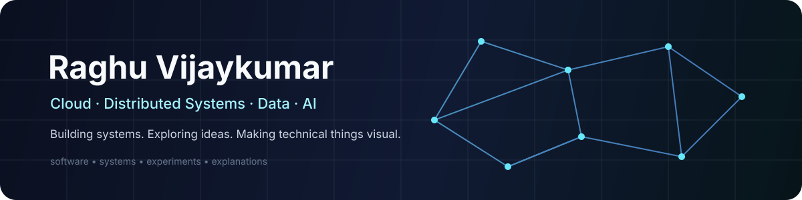

 

<a href="https://www.linkedin.com/in/raghuvijaykumar/">LinkedIn</a>
&nbsp;·&nbsp;
<a href="https://github.com/raghu-vijaykumar/resume">Resume</a>
&nbsp;·&nbsp;
<a href="https://raghu-vijaykumar.github.io/blog/">Blog</a>
&nbsp;·&nbsp;
<a href="https://www.youtube.com/@reviselabs">Revise Labs</a>
&nbsp;·&nbsp;
<a href="https://leetcode.com/u/raghuvijaykumar/">LeetCode</a>

---

### 👋 A little about me

**I build systems, chase interesting problems, and turn complicated ideas into things people can understand.**

☁️ Cloud &nbsp;&nbsp; ⚙️ Distributed Systems &nbsp;&nbsp; 📊 Data &nbsp;&nbsp; 🧠 AI

I spend most of my time somewhere between **production systems and side projects**.

---

## 🚀 Things I'm building

<table>
<tr>
<td width="50%" valign="top">

### 🎬 Revise Labs

Making **CS, AI, physics & engineering** visual.

Motion graphics · Remotion · R3F · Three.js

<a href="https://www.youtube.com/@reviselabs">▶ Watch Revise Labs</a>

</td>
<td width="50%" valign="top">

### 📚 Engineering Blog

Deep dives into **systems, architecture, data, and engineering problems**.

Hugo · GitHub Pages · Long-form technical writing

<a href="https://raghu-vijaykumar.github.io/blog/">↗ Read the blog</a>

</td>
</tr>
<tr>
<td width="50%" valign="top">

### 🧩 Beyond System Design

A growing collection of ideas around **system design, distributed systems, and engineering fundamentals**.

<a href="https://github.com/raghu-vijaykumar/beyond-system-design">→ Explore</a>

</td>
<td width="50%" valign="top">

### 🧪 Experiments

Small projects, prototypes, algorithms, developer tooling and whatever looks interesting enough to build.

<a href="https://github.com/raghu-vijaykumar?tab=repositories">→ Browse repositories</a>

</td>
</tr>
</table>

---

## ⚡ What I enjoy

| ☁️ Cloud | ⚙️ Systems | 📊 Data | 🧠 AI | 🎨 Creative Code |
|:---:|:---:|:---:|:---:|:---:|
| OCI · AWS · GCP | Distributed Systems | Streaming · Pipelines | RAG · Agents · LLMs | React · R3F · Three.js |

---

## 🔭 Currently exploring

`Agents` · `RAG` · `System Design` · `Distributed Systems` · `Local-first AI` · `Creative Coding`

---

### Build → Learn → Explain → Repeat

 

Always experimenting. Sometimes overengineering. Usually learning something.

